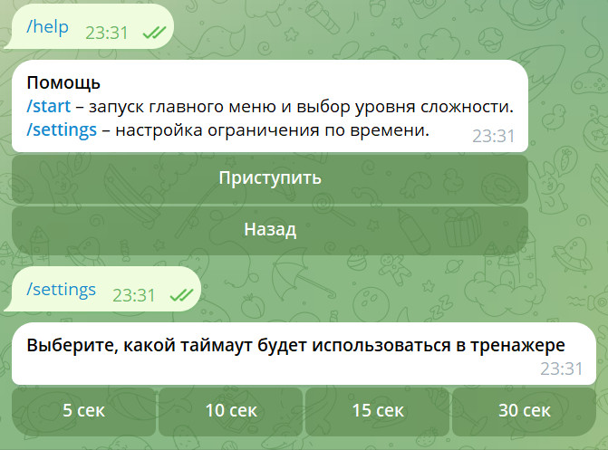
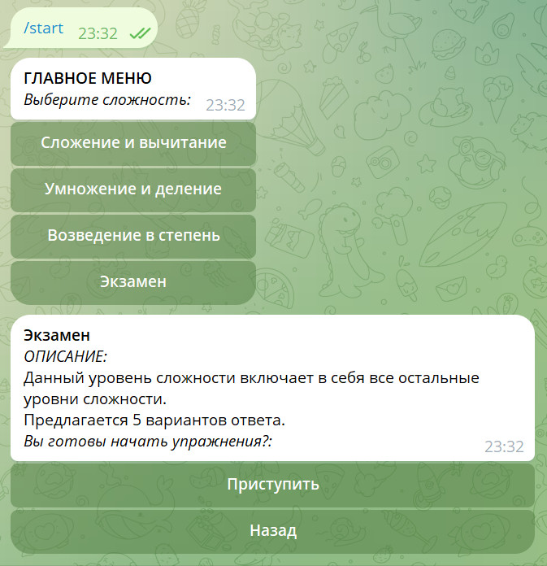
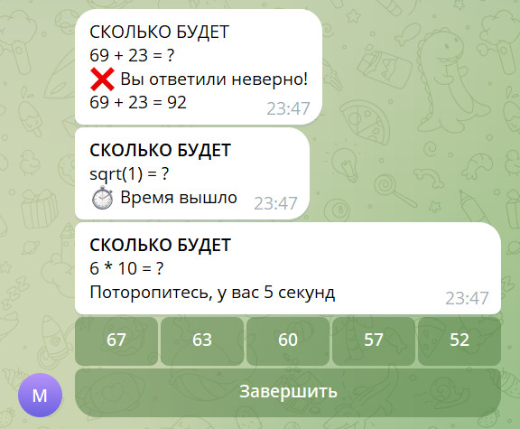
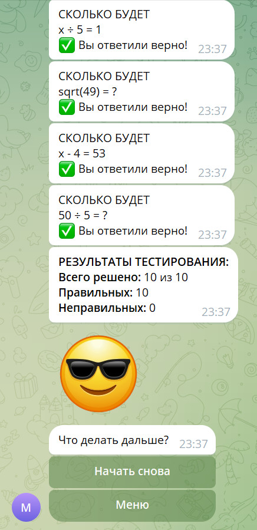

# Telegram-бот для тренировки математических навыков 

---

### Инструкция по установке 

1. Склонировать репозиторий https://github.com/Quasarel/Math-bot.git;
2. Открыть проект в IDE с виртуальной средой Python 3.11;
3. Установить зависимости командой ```pip install -r requirements.txt```;
4. Переименовать файл .env.example в .env и указать токен ```TOKEN = (токен вашего бота)```;
5. Запустить файл ```main.py``` в виртуальной среде через IDE.
---
>Использует фреймворк aiogram для взаимодействия с API Telegram и базы данных SQLite для хранения настроек пользователей.

* Команда **/help** – выводит информацию о командах бота.
* Команда **/settings** – открывает меню для выбора таймаута (времени ответа на вопрос) в тренажере. При выборе таймаута выбранное значение сохраняется в базе данных.



* Команда **/start** – открывает меню с возможностью выбора уровня сложности и начала тренировки.



При выборе уровня сложности, бот генерирует математическое уравнение и предлагает пользователю выбрать правильный ответ из предложенных вариантов.

* При выборе **правильного** ответа, выводится сообщение, что вы ответили верно, и генерируется новое уравнение. 
* При выборе **неправильного** ответа, выводится сообщение, что вы ответили неверно, показывается правильный ответ и генерируется новое уравнение. 
* При **истечении времени**, выводится сообщение о том, что время вышло, и генерируется новое уравнение.



После ответа на заданное количество вопросов, выводятся результаты тренировки (количество правильных и неправильных ответов) и соответствующая реакция. 



### Состав команды

* Михаил Дорохин Андреевич. Группа 4216.